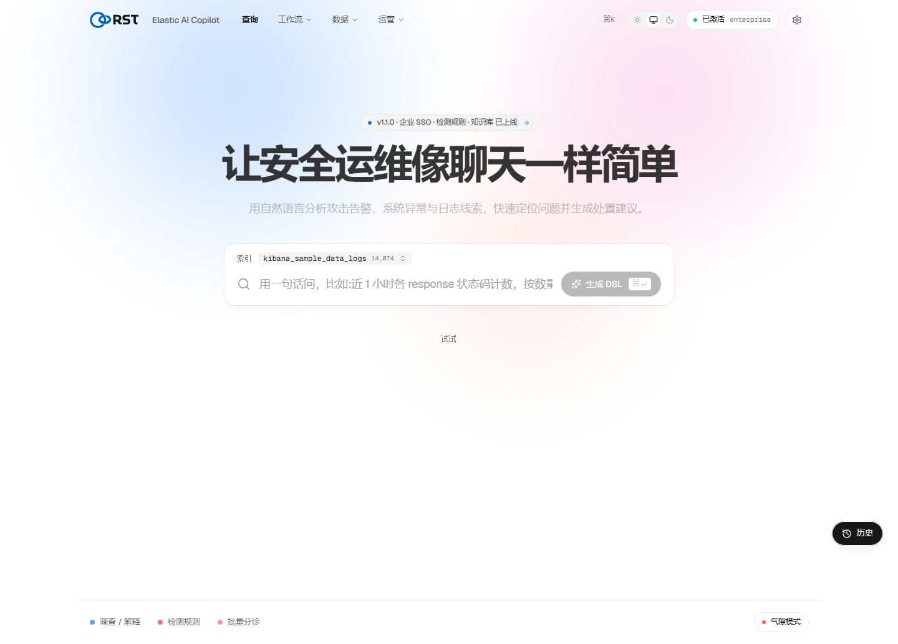
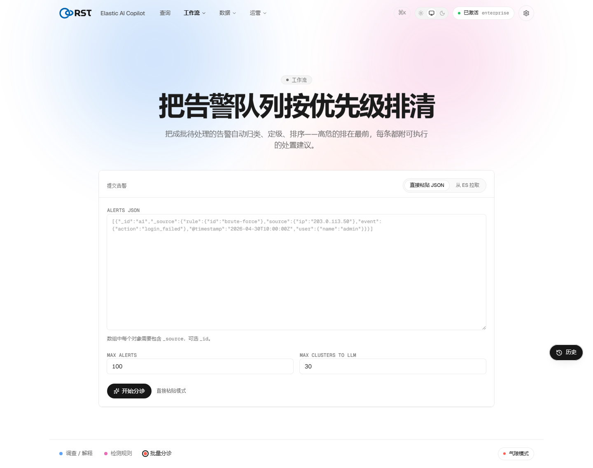
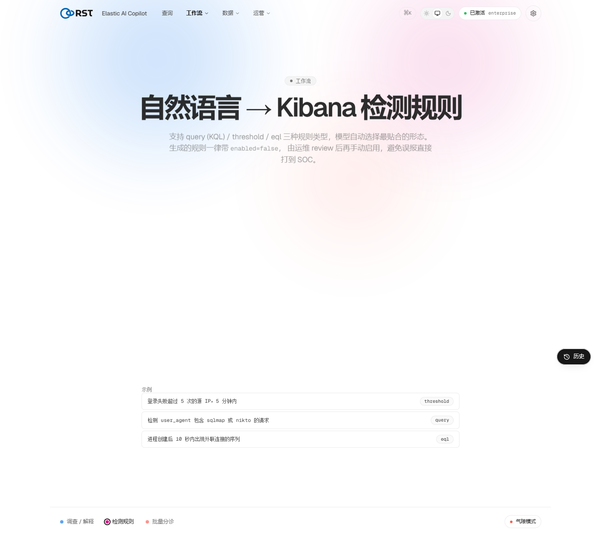
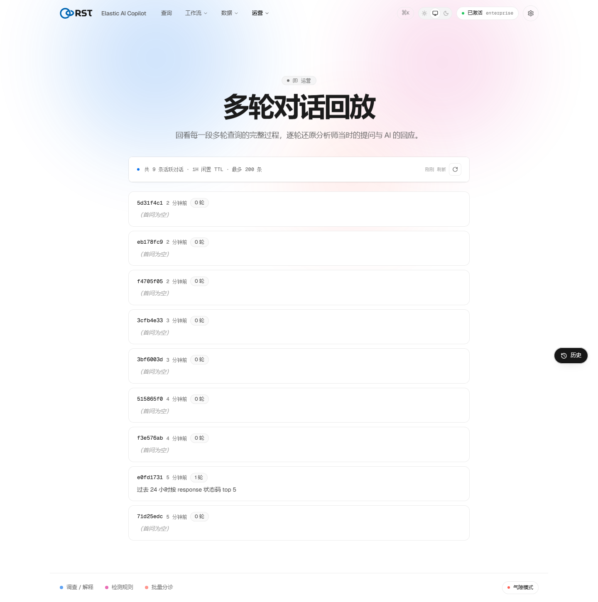
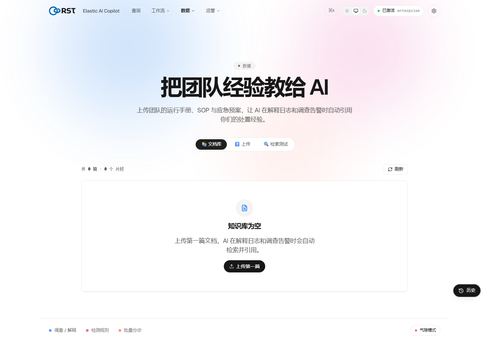
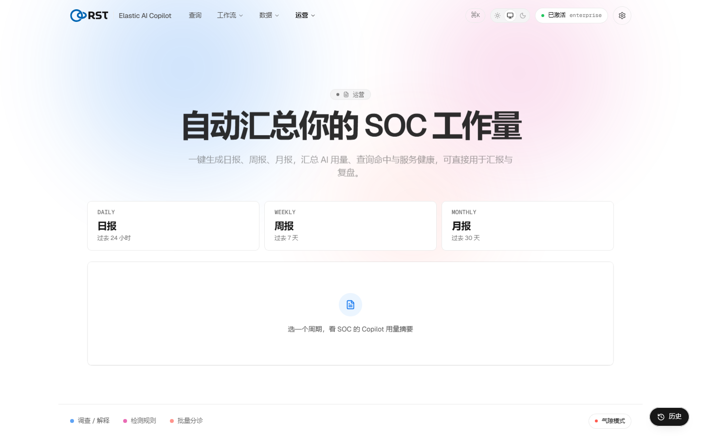
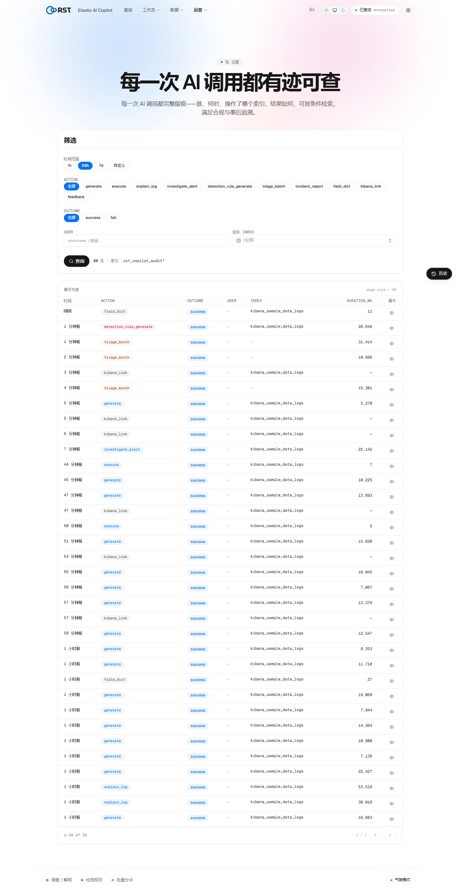

<!-- Community Edition -->
> **RST Elastic AI Copilot — Community Edition.** Apache-2.0. This tree is
> exported from the product repository; the four paid engines (alert triage,
> alert investigation, detection-rule copilot, platform-ops copilot) are not
> included — the UI shows them as "requires a license". Everything else is
> here and runs. A commercial license activates in place, no reinstall.
>
> **Trademark.** "RST", "Reallysec" and the product logos are trademarks of
> Reallysec and are NOT licensed under Apache-2.0. A modified distribution
> must not use them in a way that suggests it is the official product.
>
> **Install.** Either take the prebuilt bundle from this repository's Releases
> (`RST-Elastic-AI-Copilot-<version>.tar.gz`, then `./deploy.sh`), or build the
> gateway image from this tree and run the same compose stack:
>
> ```bash
> docker build -t rst-elastic-ai-copilot-gateway:community .
> cp .env.example .env            # fill LLM_*, ES_*, CADDY_SITE_ADDRESS, secrets
> echo GATEWAY_IMAGE_TAG=community >> .env
> docker compose -f docker-compose.prod.yml up -d
> ```
>
> Docs: https://reallysec.com/docs/elastic-ai-copilot

<h1 align="center">RST Elastic AI Copilot</h1>

<p align="center">
  <b>The AI layer for security operations on Elasticsearch & Kibana.</b><br>
  Natural language in. Executable DSL, triaged alerts, and detection rules out — every answer inspectable.
</p>

<p align="center">
  
  
  
  
  
</p>

<p align="center">
  <b>English</b> · <a href="README.zh-CN.md">简体中文</a>
</p>

<p align="center">
  
</p>

---

RST Elastic AI Copilot sits on top of a customer's **existing Elasticsearch / Kibana** and turns
the work a SOC actually runs — querying, triaging, rule-writing, investigating — into natural
language, without giving up control. It is built for **private / on-premise / air-gapped**
deployments where data never leaves the customer network and every model call is audited.

It is not a chat box bolted onto a search bar. The natural-language input is one affordance
inside a real analyst workflow, and **trust is the product**: the generated DSL, the reasoning,
and the audit record are always on the table for the analyst to verify or override.

## Why it exists

Analysts lose time translating intent into Elasticsearch DSL and Kibana detection rules, and
managers can't see what an AI actually did on their data. This copilot closes both gaps: a high
first-run success rate on **natural-language → executable, read-only-validated DSL**, wrapped in
batch triage, rule authoring, guided investigation, and a complete audit trail — deployed inside
the customer's own perimeter.

## Features

### Natural language → Elasticsearch DSL
Ask in plain language; get validated, **read-only** ES DSL with the query shown before it runs.
Field dictionary and response caching keep it grounded and fast. The analyst runs it only once
they trust it.

### Batch alert triage


Paste a batch of alerts (or pull from ES) and the copilot **clusters, grades, and orders** them —
high-risk first — with an actionable disposition per cluster. Clear a queue faster than by hand.

### Detection-rule authoring


Describe a behavior; get a Kibana detection-engine rule with MITRE ATT&CK mapping, ready to
preview and ship.

### Guided investigation


Multi-turn investigation that keeps context across steps — a fresh question stays independent, a
follow-up continues the thread. Every conversation is retained for review.

### Knowledge base (RAG)


Ground answers in the customer's own runbooks and SOPs. Retrieved context is surfaced on every
answer, so influence is visible, never hidden.

### Reports, dashboards & audit



Scheduled inspection reports, team dashboards, and a **full audit trail of every model call** —
token usage included — so managers can review exactly what the AI did and report up.

### And the rest of the SOC surface
- **Security-baseline inspection** — deterministic 等保 2.0 / CIS checks over osquery results; no
  LLM, air-gap safe.
- **Asset & identity enrichment** — Elastic-native context on entities in an investigation.
- **Data masking** — cloud / private / air-gapped modes; sensitive values never leave the boundary.
- **Multi-provider LLM failover** — survive an outage; every answer logs which model served it.

## Architecture

```
Analyst browser ──HTTPS(443)──▶  Caddy reverse proxy  ──HTTP(internal)──▶  AI Gateway (FastAPI)
                                 TLS + login auth                          │
                                                                           ├─▶ LLM endpoint (Volcengine Ark / self-hosted)
                                                                           ├─▶ Customer Elasticsearch / Kibana
                                                                           └─▶ license.reallysec.com (activation / heartbeat)
```

Enterprise SSO adds an oauth2-proxy + Keycloak forward-auth layer between Caddy and the gateway.

## Deployment

Ships as a single self-contained bundle — the gateway image (license enforcement compiled into
native binaries) plus every deploy file. No registry, no internet required on the customer host.

```bash
tar xzf RST-Elastic-AI-Copilot-<version>.tar.gz
cd RST-Elastic-AI-Copilot-<version> && ./deploy.sh
```

`deploy.sh` loads the image, generates secrets, writes config, and brings the stack up behind
Caddy TLS. It connects to the customer's **own** Elasticsearch — it ships no ES of its own.

Full guide: **[`docs/DEPLOYMENT.md`](docs/DEPLOYMENT.md)** (ports, DNS, license, online update,
troubleshooting) · single-user quick path [`docs/DEPLOY-RUNBOOK.md`](docs/DEPLOY-RUNBOOK.md) ·
content signing [`docs/CONTENT-SIGNING.md`](docs/CONTENT-SIGNING.md)

## Security & licensing

- **Private by design** — runs inside the customer perimeter; the analyst's browser is the only
  ingress (443), egress is limited to the LLM, the customer ES, and the license server.
- **Read-only on customer data** by default; audit and UI state live in the gateway's own
  `.rst_copilot_*` indices.
- **License-enforced** — online activation with offline / air-gapped token support; enforcement
  modules are compiled to native binaries in the image.
- **Health-gated online updates** with automatic rollback; signed release + content packs.

Commercial software. © ReallySec. Contact the vendor for licensing and evaluation.

---

<p align="center"><sub>Built for SOC / MDR / 等保 / 国产化 · Elasticsearch 8.x · Docker</sub></p>
