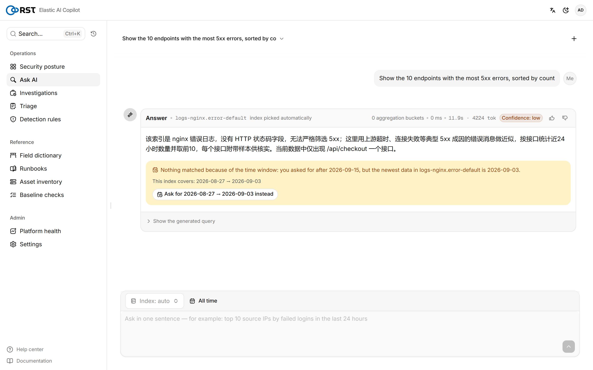
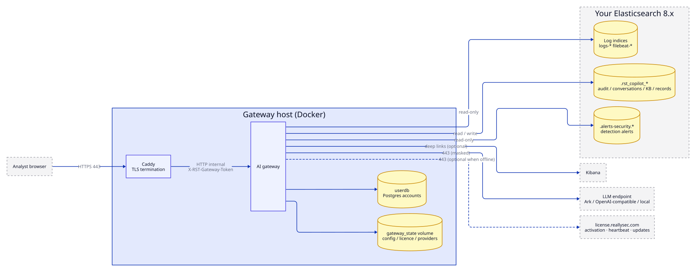
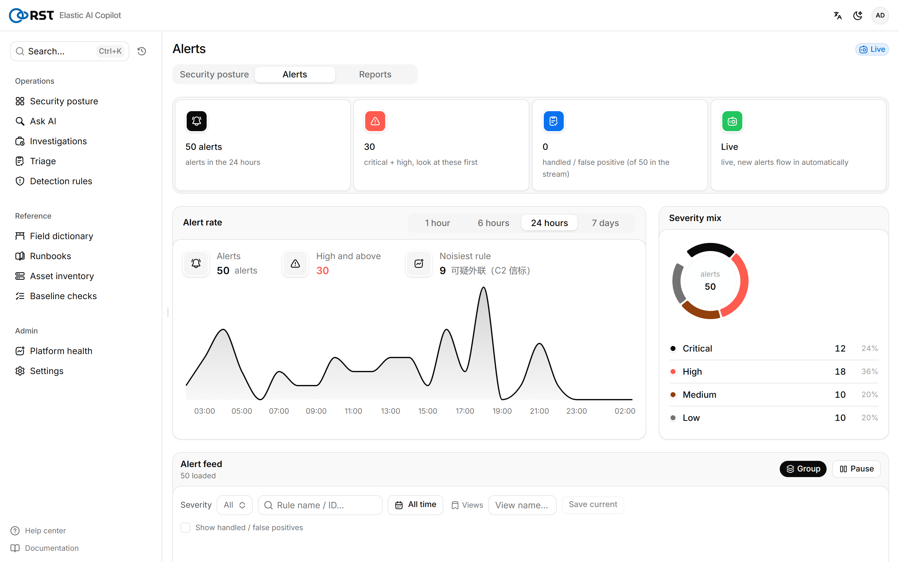
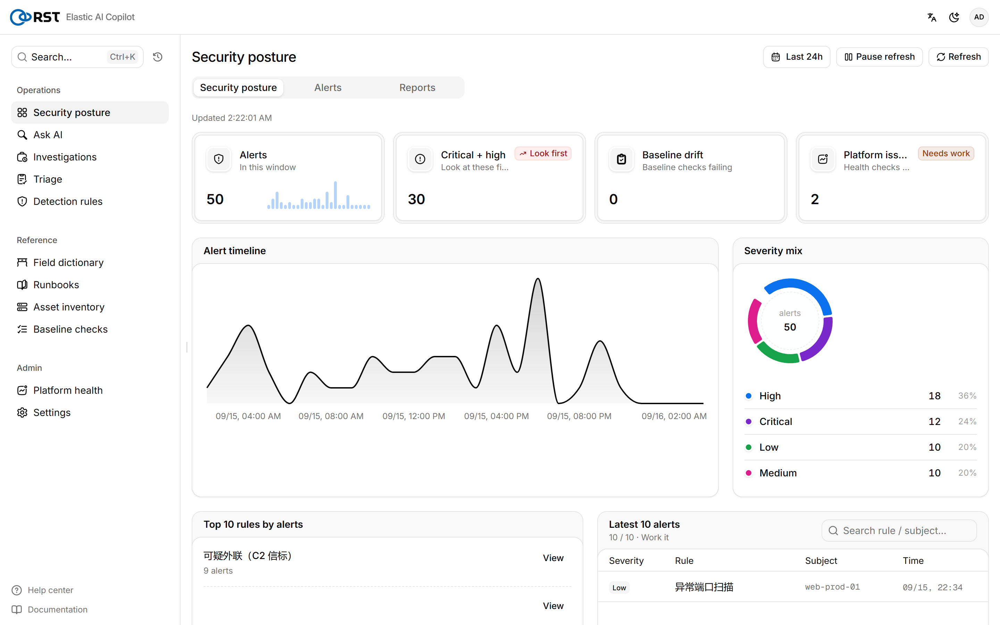
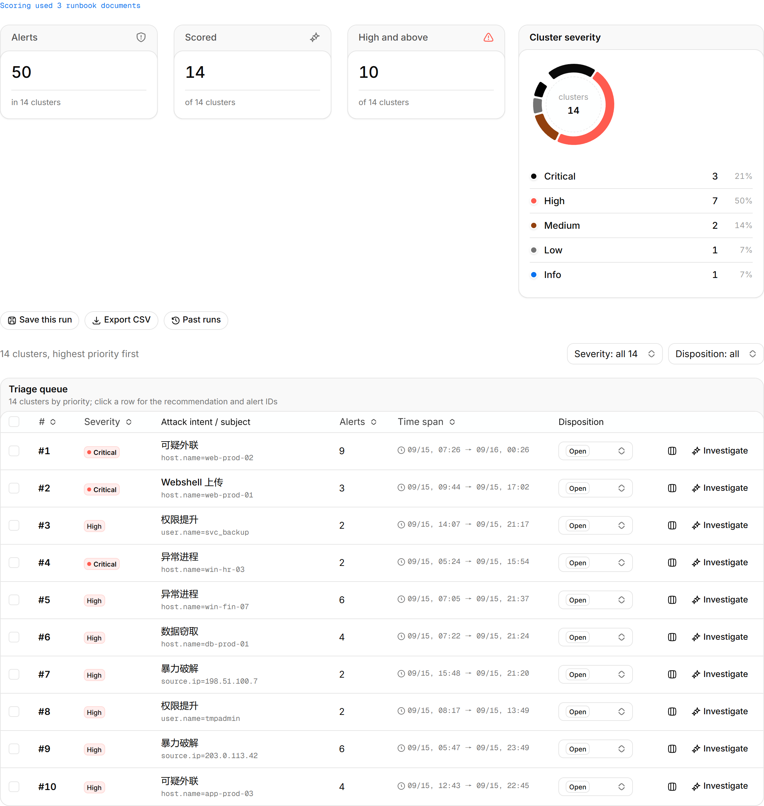
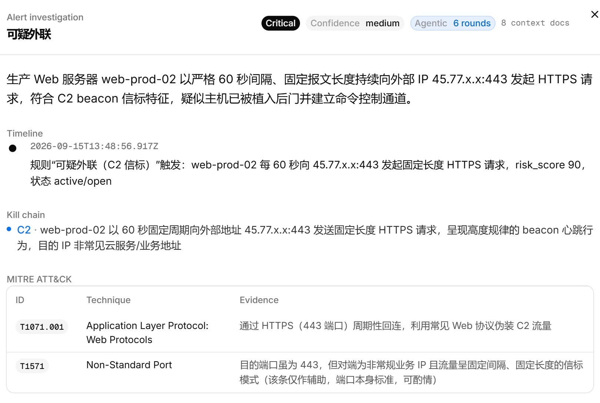
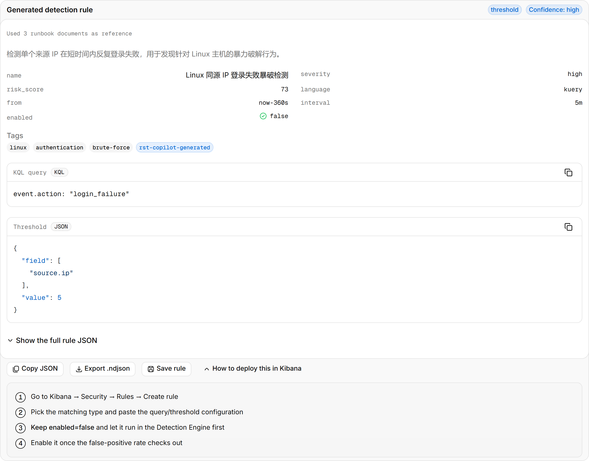

<!-- Community Edition: exported from the product repository; the four paid
     engines are not in this tree. README below covers both editions. -->
<h1 align="center">RST Elastic AI Copilot</h1>

<p align="center">
  Security-operations copilot for an existing Elasticsearch 8.x / Kibana.<br>
  Natural language in; read-only DSL, triaged alerts, investigations and detection rules out. Every model call audited.
</p>

<p align="center">
  <b>English</b> · <a href="README.zh-CN.md">简体中文</a> · <a href="https://reallysec.com/docs/elastic-ai-copilot">Docs</a> · <a href="https://github.com/reallysec/elastic-ai-copilot-community/releases">Community releases</a>
</p>

<p align="center">
  
</p>

## What it is

One Docker gateway inside the customer network. It does not ship Elasticsearch: it connects to the ES / Kibana already in place, reads logs and alerts from there, and writes only its own `.rst_copilot_*` indices. Deployment targets are private, on-premise and air-gapped sites; the LLM endpoint is whatever the customer points it at (Volcengine Ark, OpenAI-compatible, self-hosted vLLM / Ollama).

<p align="center">
  
</p>

## Capabilities

| | Community (Apache-2.0) | Standard / Enterprise |
|---|:---:|:---:|
| Smart query: NL → Elasticsearch DSL, read-only validation, dry run, aggregation and hit tables, multi-turn | ✅ | ✅ |
| Empty-result diagnosis: wrong time window, blocking clause, wrong index, unmatched source | ✅ | ✅ |
| Live alerts: `.alerts-security` polling or Kibana webhook, per-alert summary, grouping, dispositions | ✅ | ✅ |
| Posture, operations reports (daily / weekly / monthly), audit trail with syslog / webhook forwarding | ✅ | ✅ |
| Field dictionary, runbook knowledge base (RAG), asset & identity ledger, CIS / MLPS 2.0 baseline over osquery | ✅ | ✅ |
| Field masking (cloud / private / air-gapped), multi-provider LLM failover, per-task reasoning levels | ✅ | ✅ |
| Users and roles (admin / analyst / read-only), OIDC SSO, notifications (Feishu, DingTalk, WeCom, Teams, Slack, mail) | ✅ | ✅ |
| **Alert batch triage**: cluster by intent and subject, model-scored severity and false-positive verdicts | — | ✅ |
| **Alert investigation**: agentic evidence gathering, timeline, MITRE ATT&CK, affected assets, actions | — | ✅ |
| **Detection-rule copilot**: KQL / EQL / threshold rules with ATT&CK mapping, `.ndjson` export | — | ✅ |
| **Platform-ops copilot**: AI read of the Elastic cluster check-up | — | ✅ |

The four paid engines ship as encrypted blobs; the decryption keys are issued per host by the licence server. A Community install activates a commercial licence in place, no reinstall. Trial = Standard for 14 days, one host.

<table>
  <tr>
    <td></td>
    <td></td>
  </tr>
  <tr>
    <td></td>
    <td></td>
  </tr>
</table>

<p align="center">
  
</p>

## Install

Requirements: a Linux host with Docker Engine 24+ and Compose v2, network access to Elasticsearch 8.x, an OpenAI-compatible LLM endpoint, and a hostname for the analysts (an IP is not a valid TLS SNI). Full list: [requirements](https://reallysec.com/en/docs/elastic-ai-copilot/install/requirements).

**From a bundle** (commercial delivery, or a [community release](https://github.com/reallysec/elastic-ai-copilot-community/releases)):

```bash
sha256sum -c RST-Elastic-AI-Copilot-<version>.tar.gz.sha256
tar xzf RST-Elastic-AI-Copilot-<version>.tar.gz
cd RST-Elastic-AI-Copilot-<version> && ./deploy.sh
```

`deploy.sh` loads the images, generates secrets and the host fingerprint, asks for the LLM and ES endpoints, and starts the stack behind Caddy TLS. About two minutes; then `https://<hostname>/v2/`.

**From source** (this tree):

```bash
docker build -t rst-elastic-ai-copilot-gateway:dev .
cp .env.example .env            # LLM_*, ES_*, CADDY_SITE_ADDRESS, secrets
echo GATEWAY_IMAGE_TAG=dev >> .env
docker compose -f docker-compose.prod.yml up -d
```

Upgrade, rollback, backup, SSO, ES permissions and every `.env` key: [installation docs](https://reallysec.com/en/docs/elastic-ai-copilot/install/deploy).

## Data boundary

- Ingress: analyst browser on 443 only. Egress: the LLM endpoint, the customer's ES / Kibana, `license.reallysec.com` (not needed with an offline licence).
- Read-only on customer indices; the index whitelist bounds what the model may query.
- Field masking runs before anything reaches the model; in air-gapped mode nothing leaves the network.
- Every login, query, model call and settings change is an audit event (`.rst_copilot_audit`), forwardable to a SIEM.

## Licensing

- **Community Edition**: this tree, Apache-2.0, published at [reallysec/elastic-ai-copilot-community](https://github.com/reallysec/elastic-ai-copilot-community). "RST", "Reallysec" and the product logos are trademarks and not covered by the licence.
- **Standard / Enterprise**: the four paid engines, activated online or with an offline `.lic`. Trials and licences: [console.reallysec.com](https://console.reallysec.com).

© Anhui Reallysec Information Technology Ltd.
