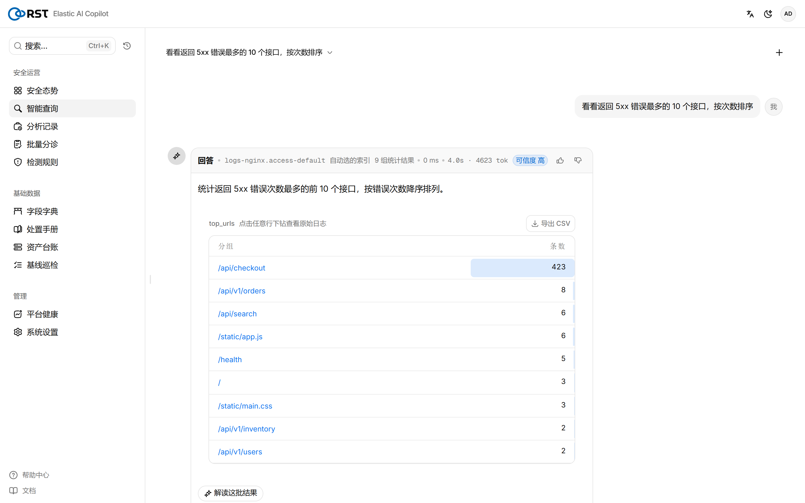
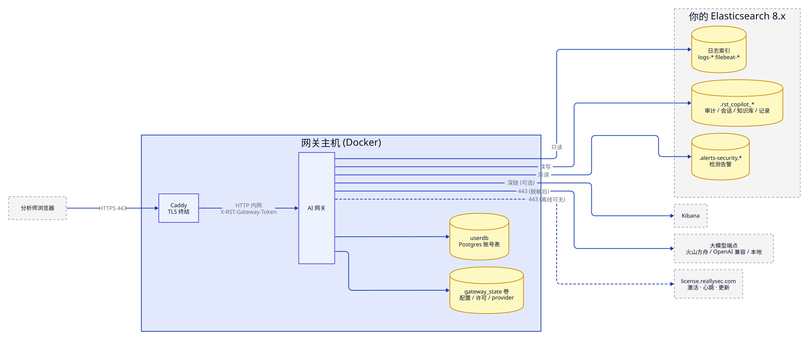
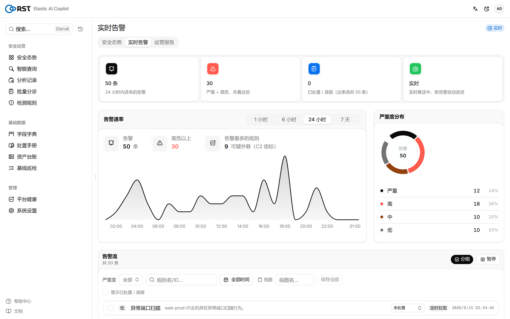
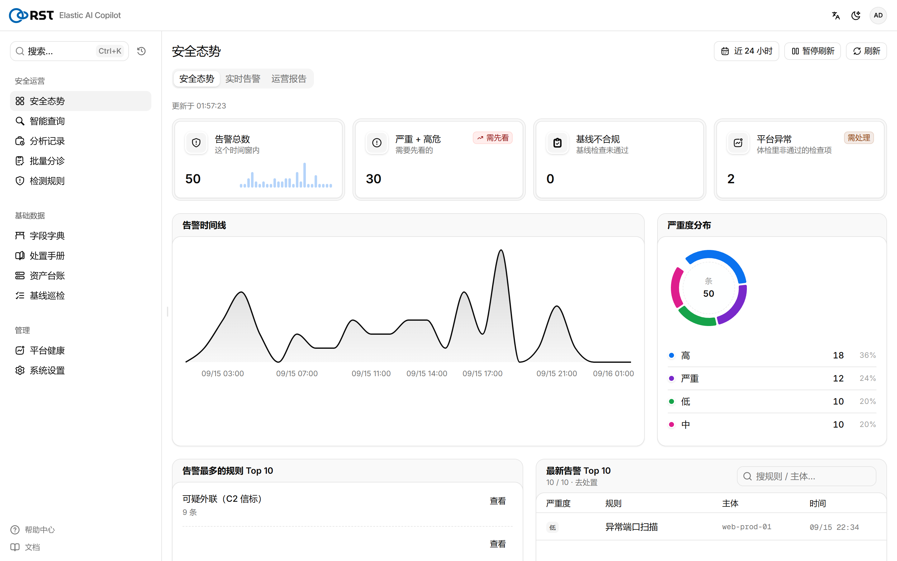
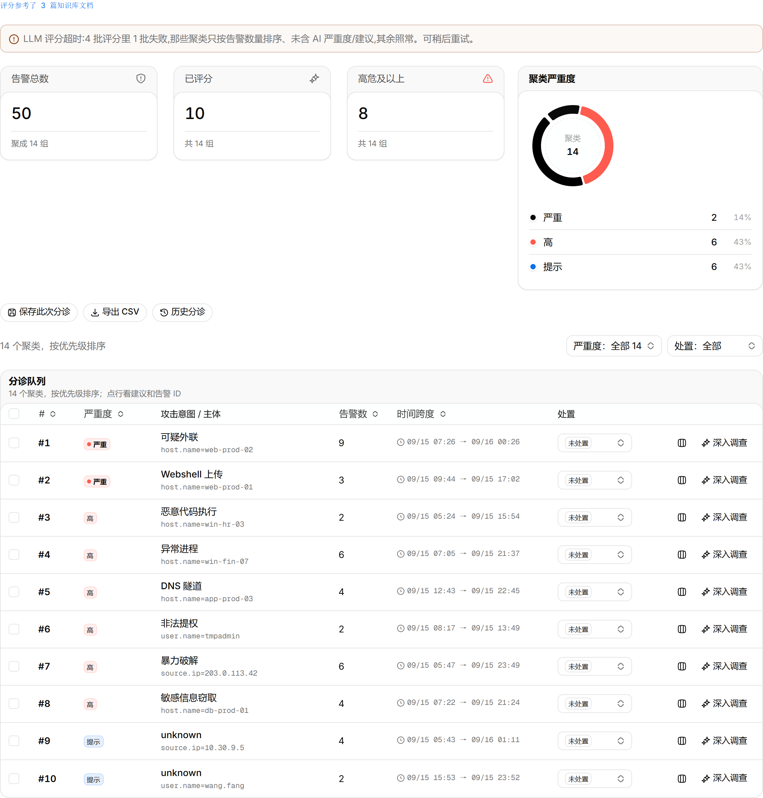
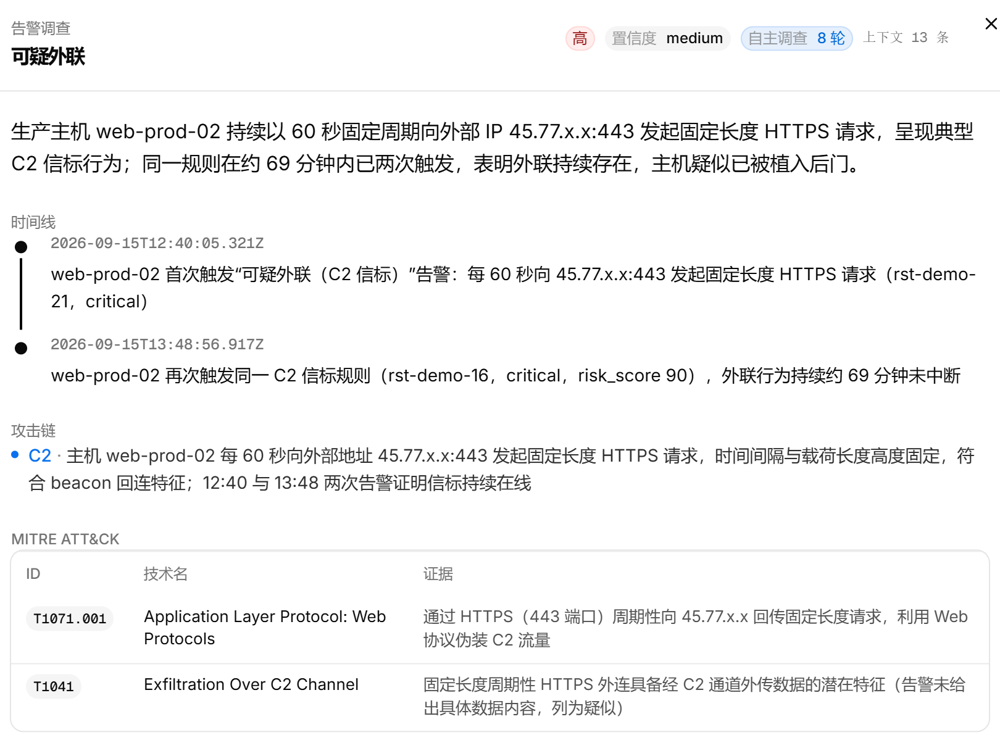
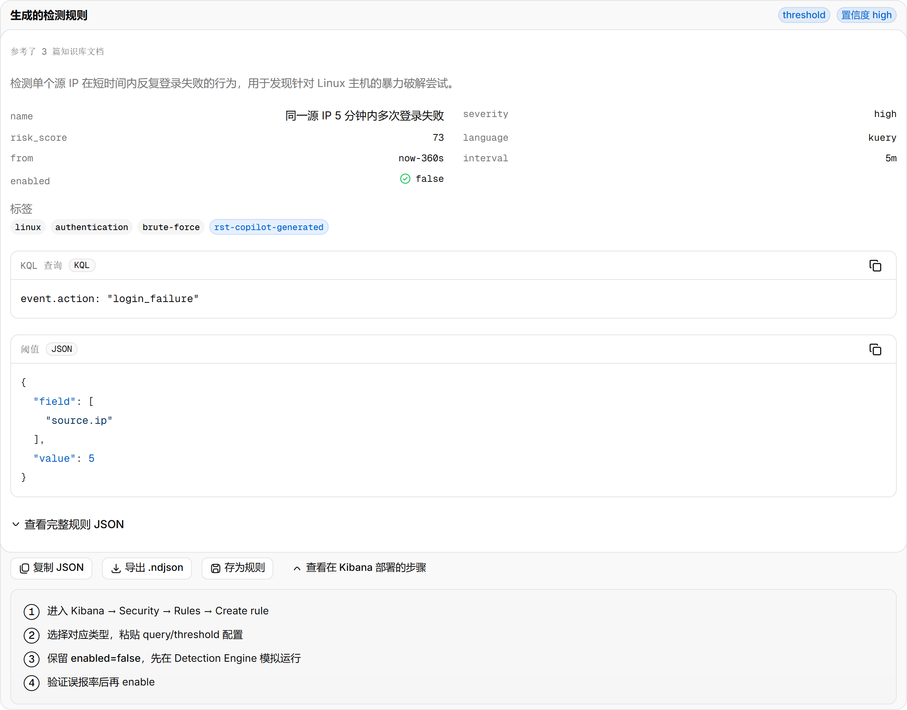

<!-- Community Edition: exported from the product repository; the four paid
     engines are not in this tree. README below covers both editions. -->
<h1 align="center">RST Elastic AI Copilot</h1>

<p align="center">
  接在已有 Elasticsearch 8.x / Kibana 上的安全运营助手。<br>
  自然语言进，只读 DSL、分级后的告警、调查报告和检测规则出；每一次模型调用都有审计。
</p>

<p align="center">
  <a href="README.md">English</a> · <b>简体中文</b> · <a href="https://reallysec.com/docs/elastic-ai-copilot">文档</a> · <a href="https://github.com/reallysec/elastic-ai-copilot-community/releases">社区版下载</a>
</p>

<p align="center">
  
</p>

## 它是什么

部署在客户内网的一个 Docker 网关。不带 Elasticsearch：接在已有的 ES / Kibana 上，日志和告警从集群里读，自己只写 `.rst_copilot_*` 索引。面向私有化、内网和气隙环境；大模型端点由客户指定（火山方舟、OpenAI 兼容端点、自建 vLLM / Ollama）。

<p align="center">
  
</p>

## 能力

| | 社区版（Apache-2.0） | 标准版 / 企业版 |
|---|:---:|:---:|
| 智能查询：自然语言 → Elasticsearch DSL，只读校验、试跑、聚合表 / 明细表、多轮追问 | ✅ | ✅ |
| 结果为空的诊断：时间窗不对、条件卡住、索引选错、多源未命中 | ✅ | ✅ |
| 实时告警：轮询 `.alerts-security` 或 Kibana webhook，逐条摘要、分组、处置状态 | ✅ | ✅ |
| 安全态势、日 / 周 / 月运营报告、调用审计（可转发 syslog / webhook） | ✅ | ✅ |
| 字段字典、处置手册知识库（RAG）、资产台账、基于 osquery 的等保 2.0 / CIS 基线 | ✅ | ✅ |
| 字段脱敏三档（云端 / 私有 / 离网）、多 provider 故障转移、按任务分级的推理强度 | ✅ | ✅ |
| 用户与三档角色、OIDC SSO、对外通道（飞书、钉钉、企业微信、Teams、Slack、邮件） | ✅ | ✅ |
| **告警批量分级**：按意图和主体聚簇，模型评严重度、判误报 | — | ✅ |
| **告警调查**：自主取证、时间线、MITRE ATT&CK、受影响资产、处置建议 | — | ✅ |
| **检测规则生成**：KQL / EQL / 阈值规则，ATT&CK 映射，导出 `.ndjson` | — | ✅ |
| **功能管理助手**：Elastic 集群体检的 AI 解读 | — | ✅ |

四个付费引擎以密文交付，解密密钥由许可服务器按主机下发。社区版装上商业许可即原地激活，不用重装。试用 = 标准版 14 天，一台主机。

<table>
  <tr>
    <td></td>
    <td></td>
  </tr>
  <tr>
    <td></td>
    <td></td>
  </tr>
</table>

<p align="center">
  
</p>

## 安装

要求：一台 Linux 主机（Docker Engine 24+、Compose v2），能访问 Elasticsearch 8.x，一个 OpenAI 兼容的大模型端点，一个给分析师用的域名（裸 IP 不是合规的 TLS SNI）。完整清单见[系统要求](https://reallysec.com/docs/elastic-ai-copilot/install/requirements)。

**用交付包**（商业交付，或[社区版 Release](https://github.com/reallysec/elastic-ai-copilot-community/releases)）：

```bash
sha256sum -c RST-Elastic-AI-Copilot-<版本>.tar.gz.sha256
tar xzf RST-Elastic-AI-Copilot-<版本>.tar.gz
cd RST-Elastic-AI-Copilot-<版本> && ./deploy.sh
```

`deploy.sh` 加载镜像、生成密钥和主机指纹、询问大模型与 ES 地址，然后在 Caddy TLS 后面起整个栈。约两分钟，之后打开 `https://<域名>/v2/`。

**从源码**（本仓库）：

```bash
docker build -t rst-elastic-ai-copilot-gateway:dev .
cp .env.example .env            # LLM_*、ES_*、CADDY_SITE_ADDRESS、密钥
echo GATEWAY_IMAGE_TAG=dev >> .env
docker compose -f docker-compose.prod.yml up -d
```

升级、回滚、备份、SSO、ES 权限、全部 `.env` 项：[安装文档](https://reallysec.com/docs/elastic-ai-copilot/install/deploy)。

## 数据边界

- 入站只有分析师浏览器的 443。出站：大模型端点、客户的 ES / Kibana、`license.reallysec.com`（离线许可不需要）。
- 对客户索引只读；索引白名单限定模型能查的范围。
- 字段脱敏在数据发给模型之前完成；离网模式不出网。
- 每次登录、查询、模型调用、设置变更都是一条审计事件（`.rst_copilot_audit`），可转发到 SIEM。

## 许可

- **社区版**：本仓库，Apache-2.0，发布在 [reallysec/elastic-ai-copilot-community](https://github.com/reallysec/elastic-ai-copilot-community)。「RST」「Reallysec」和产品标识是商标，不在该许可范围内。
- **标准版 / 企业版**：四个付费引擎，在线激活或离线 `.lic`。试用与购买：[console.reallysec.com](https://console.reallysec.com)。

© 安徽斯普朗克信息技术有限公司（Anhui Reallysec Information Technology Ltd.）
